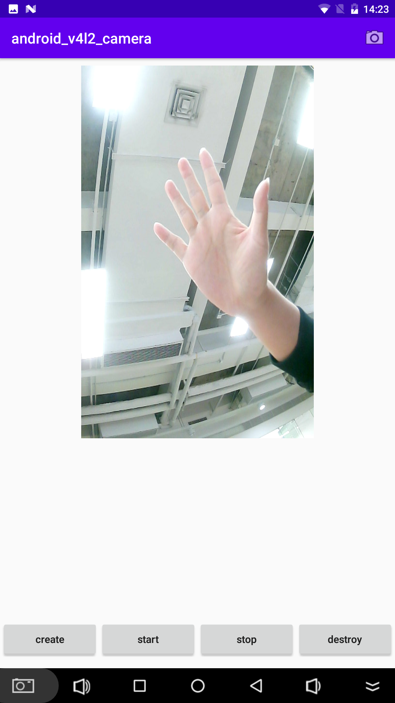

# android_v4l2_camera
🔥 V4L2 Camera on Android

### Image


### Sample
|  |
| :--------:                      |
| Scan QR code or [Download][1]   |

### App Running Environment
```text
If your app can't access /dev/video* on Android device，you need grant read and write permission.

adb shell
su
chmod 666 /dev/video*
```

### Add Function
- 1.FPS 30 of Dual cameras.
- 1.Package Android camera based on V4L2 protocol.
- 2.Support setting resolution and original format of image acquisition: MJPEG, YUYV
- 3.Use NdkMediaCodec for MJPEG decoding. If the device does not support hard decoding,
    it is recommended to use libjpeg-turbo instead of HwDecoder.
- 4.Support OpenGL ES rendering YUYV, NV12, NV21, DEPTH and other image formats.

### Plan Add Function
- 1.Add opengl filter for beauty by face color

### About Build
- CMake: 3.10.2
- Android Studio 4.0

### About Author:
- Author: shengjunhu
- Date  : 2021/05/12
- E-Mail: shengjunhu@foxmail.com
- GitHub: https://github.com/shengjunhu

### About Third Party Libraries
- [libjpeg-turbo][2]
- [libyuv][3]

### About License
```text
Copyright (c) 2020 shengjunhu
Please comply with the relevant third party libraries license
```

[1]: https://github.com/shengjunhu/android_v4l2_camera/raw/master/doc/apk/android_v4l2_camera.apk
[2]: https://github.com/libjpeg-turbo/libjpeg-turbo
[3]: https://chromium.googlesource.com/external/libyuv
